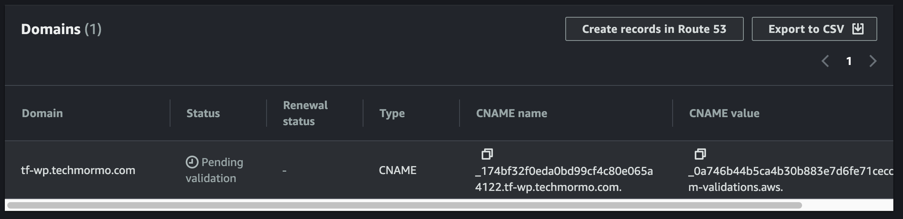
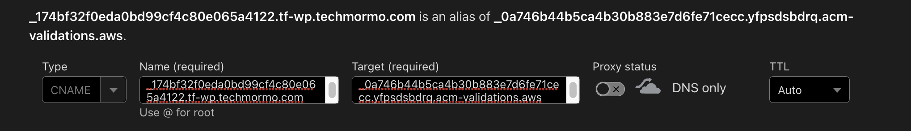
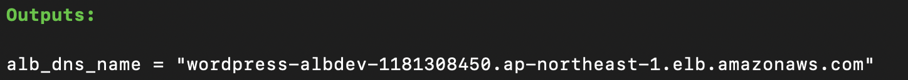
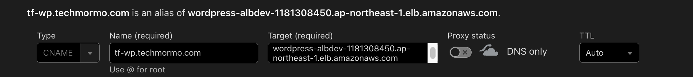
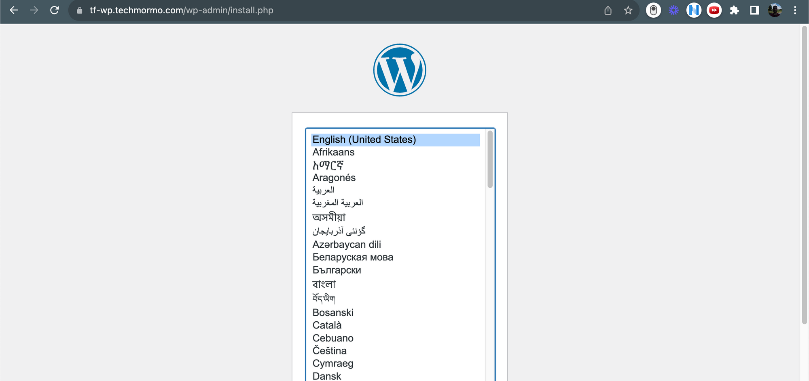
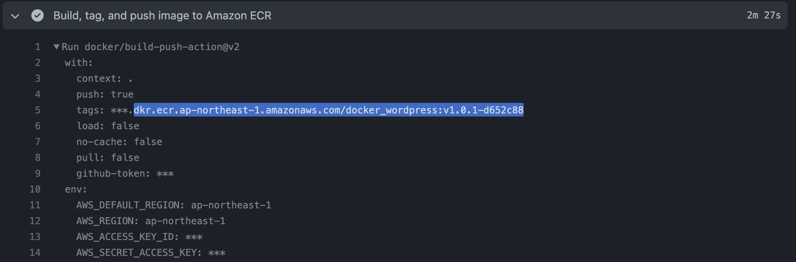

# Terraform-Wordpress Template

A template for quickly creating and deploying a WordPress application on AWS using Terraform.

## Prerequisites 🗒️

Make sure you have the following tools installed on your local machine before proceeding:

1. [git](https://git-scm.com/downloads)
2. [aws cli](https://docs.aws.amazon.com/cli/latest/userguide/getting-started-install.html)

   Also [configure your cli](https://docs.aws.amazon.com/cli/latest/userguide/getting-started-quickstart.html) to enable access to your AWS account

3. [terraform](https://developer.hashicorp.com/terraform/tutorials/aws-get-started/install-cli)

**Access to a domain**

Also, you need to own or have access to a **domain name** such as [cryptoneer.io](http://cryptoneer.io/), [techmormo.com](http://techmormo.com/) etc. If your domain is on Route 53, it will make the process easier, but you can also use domains from external registrars.

## Getting started (local state) 🚀

1.  Clone this repository on GitHub by clicking on “Use this template”
    - Make sure to check “**Include all branches**”
    - Then clone your repo to your local machine
      ```bash
      git clone <your-git-clone-url> Terraform-Wordpress
      ```
2.  Switch to the project directory

    ```bash
    cd Terraform-Wordpress
    ```

3.  Initialize terraform

    ```bash
    terraform init
    ```


4.  Set terraform workspace

    ```bash
    terraform workspace new DEV || terraform workspace select DEV
    ```

5.  Replace the value of `dns_name` on `./env/dev.tfvars` with the domain name where you want to access your WordPress application. You must have access to this domain’s DNS.

    For example:
    

    NOTE: you can modify the other variables in `./env/dev.tfvars` to further customize your project. Refer to [this doc](https://github.com/zeta-resource/Terraform-Wordpress/wiki/Customize-Terraform-Environment-Variables) for details about customizing terraform environment variables.

6.  Use terraform apply to provision the cloud resources

    ```bash
    terraform apply -var-file=env/dev.tfvars
    ```

    Give it a few minutes ⏳

    If you are not using Route53 to manage your domain, you need to do the cert validation manually.

    The following steps show how to do it using a **Cloudflare domain**:

    - Log in to the AWS web console and go to ‘AWS Certificate Manager’ on **your selected region**
    - From ‘List certificates’ find the certificate with your provided `dns_name` as the ‘Domain name’ and go to its detail page
    - Under ‘Domains’, note the ‘CNAME name’ and ‘CNAME value’
      
    - Open your domain registrar’s DNS records and add a new CNAME record based on the last step’s name and value
      
      If you’re using Cloudflare, make sure to turn OFF ‘Proxy status’.
      
      This should validate your cert in a few minutes.

7.  After deployment completes, copy the `alb_dns_name` outputted by terraform.

    It should look something like this:

    

8.  Now go to your registrar’s DNS records again and add a new CNAME record

    - name: your `dns_name` eg. `tf-wp.techmormo.com`
    - value: the `alb_dns_name`

    Then, save it.

    For example:

    

9.  Now open up your `dns_name` on your browser.

    And voila! 🪄 Your new WordPress site is ready to rock! 🪨

    

## Clean up 🧹

To delete all resources use

```bash
terraform destroy -var-file=env/dev.tfvars
```

Don’t forget to remove the DNS records you’ve added manually (if added)!

TIP: you can keep the cert validation record intact if you want to use the same domain again in the future for testing.

---

## **How to use remote S3 backend 🪣**

In the first stage, we setup terraform locally. This is the quickest way to deploy and manage the WordPress app.

We can also store state in an S3 bucket to enable collaboration with other users in the team.

1. Rename the `backend.tf` file to enable terraform to detect it

   ```bash
   mv backend.tf.bkp backend.tf
   ```

2. Replace the name of the bucket in `backend.tf` with something unique (duplicate S3 bucket names cannot exist). For example:

   ```bash
   resource "aws_s3_bucket" "state_bucket" {
     bucket        = "my-s3-state-01234"
   	...
   ```

   Optional: You may need to update the `name` of the `aws_dynamodb_table` if there’s a duplicate table in your region.

3. Use apply to create the new resources

   ```bash
   terraform apply -var-file=env/dev.tfvars
   ```

4. Edit the `main.tf` file at the root of the project as follows
   1. Uncomment the `backend "s3"` section
      1. before

         ```bash
         terraform {
           # backend "s3" {
           #   key            = "tf-wp/terraform.tfstate" # The path in the bucket where Terraform will store the state file for this set of resources.
           #   bucket         = "zeta-s3-state" # The name of the S3 bucket where Terraform will store its state files.
           #   region         = "ap-northeast-1"  # The AWS region where the S3 bucket is located.
           #   encrypt        = true # This option forces Terraform to encrypt the state data stored in S3.
           #   dynamodb_table = "zeta-state-lock" # The name of a DynamoDB table for state locking and consistency checking.
           # }

           ...
         ```

      2. after

         ```bash
         terraform {
           backend "s3" {
             key            = "tf-wp/terraform.tfstate" # The path in the bucket where Terraform will store the state file for this set of resources.
             bucket         = "zeta-s3-state" # The name of the S3 bucket where Terraform will store its state files.
             region         = "ap-northeast-1"  # The AWS region where the S3 bucket is located.
             encrypt        = true # This option forces Terraform to encrypt the state data stored in S3.
             dynamodb_table = "zeta-state-lock" # The name of a DynamoDB table for state locking and consistency checking.
           }

           ...
         ```
   2. Replace the name of the bucket with the bucket name you have in `backend.tf`
   3. Optionally, update the `dynamodb_table` or `region` if your values are different
5. Perform init

   ```bash
   terraform init
   ```

   type `yes` when terraform asks if you’d like to copy the state to new backend

And that’s it! 🔥

You’re now using S3 state + locking & consistency with DynamoDB. Ready for multi-user collaboration? 👥

**Technical Details for Nerds 🥸**

BTW, did you notice that we just solved the chicken-and-egg problem?

To use the S3 backend, we need an S3 bucket and DynamoDB table. We would have to manually create these resources before we could use them.

But since we started with local state, we could automate their creation on demand (as done above).

Neat, right? 🙌

But…

### How to switch back to local state from S3 backend?

> TL;DR: reverse the process.

1. Comment out the `backend "s3"` section
2. Init

   ```bash
   terraform init -migrate-state
   ```

3. Hide the `backend.tf` from terraform

   ```bash
   mv backend.tf backend.tf.bkp
   ```

4. Apply

   ```bash
   terraform apply -var-file=env/dev.tfvars
   ```

5. Give yourself a crisp high-five! 👏

## Setting up CI/CD pipeline 🔄

You can use Github Actions to automate your infrastructure with terraform. Following are the steps needed:

1. Enable the S3 Backend. Follow “**How to use remote S3 backend 🪣**” from above.

2. Add the following secrets to your Github repo:

   1. `AWS_ACCESS_KEY`: the AWS access key.
   2. `AWS_SECRET_KEY`: the AWS secret key.
   3. `DB_PASSWORD`: the MySQL DB password.
   4. `DB_USER`: the MySQL DB user.

3. Add the following variable to your Github repo:

   1. `REGION`: the AWS region.

4. edit the `.github/workflows/tf_deploy.yml` file as follows
   1. fix the `on` section
      1. before

         ```bash
         on:
           workflow_dispatch: #delete this line
           ## Uncomment this block
           # push:
           #   branches:
           #     - main
           #     - dev
           #   paths-ignore:
           #     - '.github/**'
           #     - 'assets/**'
           #     - '*.md'
           #     - '.gitignore'
           # pull_request:
           #   branches:
           #     - main
           #     - dev
           #   paths-ignore:
           #     - '.github/**'
           #     - 'assets/**'
           #     - '*.md'
           #     - '.gitignore'
           ##
         ```

      2. after

         ```bash
         on:
           push:
             branches:
               - main
               - dev
             paths-ignore:
               - '.github/**'
               - 'assets/**'
               - '*.md'
               - '.gitignore'
           pull_request:
             branches:
               - main
               - dev
             paths-ignore:
               - '.github/**'
               - 'assets/**'
               - '*.md'
               - '.gitignore'
         ```
5. Push your code to the repo and your pipeline will be activated!

According to the config shown above, it will only run on push or pull requests (PRs) for `main` and `dev` branches.

## Build and use your custom WordPress image 🐳

So far, we have been using the public WordPress image from docker-hub directly. This is simple and gets us going fast! ⚡️

But, if you need to customize your image, this section is for you! 👌

1. Firstly, we need to create the ECR image registry to store our custom images on
    1. create new workspace for ECR
        
        ```bash
        terraform workspace new ECR || terraform workspace select ECR
        ```
        
    2. terraform apply to only target the `ecr_repository` module
        
        ```bash
        terraform apply -var-file=env/dev.tfvars -target=module.ecr_repository
        ```
        
    3. switch back to DEV
        
        ```bash
        terraform workspace new DEV || terraform workspace select DEV
        ```
        
2. Build and push image to to ECR
    1. Clone the [Docker-Wordpress](https://github.com/zeta-resource/Docker-Wordpress/) repo
    2. Setup the CI/CD on that repo
        1. Add the following secrets to your Github repo:
            1. `AWS_ACCESS_KEY`: the AWS access key.
            2. `AWS_SECRET_KEY`: the AWS secret key.
            
        2. Add the following variable to your Github repo:
            1. `REGION`: the AWS region.
        3. fix the `on` section on the file `.github/workflows/docker.yml` as follows → to enable pipeline on push
            1. before (your’s may be different)
                
                ```yaml
                on:
                  workflow_dispatch:
                  # push:
                  #   branches: [main]
                ```
                
            2. after
                
                ```yaml
                on:
                  workflow_dispatch:
                  push:
                    branches: [ main ]
                ```
         4. the following is the final contents of `.github/workflows/docker.yml` at the time of writing:
            
            ```yaml
            name: Build and Push New Docker Image

            on:
            workflow_dispatch:
            push:
               branches: [ main ]

            jobs:
            docker:
               runs-on: ubuntu-latest

               steps:
               - uses: actions/checkout@v3

               - name: Configure AWS credentials
                  uses: aws-actions/configure-aws-credentials@v1
                  with:
                  aws-access-key-id: ${{ secrets.AWS_ACCESS_KEY }}
                  aws-secret-access-key: ${{ secrets.AWS_SECRET_KEY }}
                  aws-region: ${{ vars.REGION }}

               - name: Login to Amazon ECR
                  id: login-ecr
                  uses: aws-actions/amazon-ecr-login@v1
                  with:
                  mask-password: 'true'

               - name: Set short git sha
                  id: gitsha
                  run: echo "sha_short=$(git rev-parse --short HEAD)" >> $GITHUB_OUTPUT

               - name: Build, tag, and push image to Amazon ECR
                  id: build-image
                  uses: docker/build-push-action@v2
                  with:
                  context: .
                  push: true
                  tags: ${{ steps.login-ecr.outputs.registry }}/docker_wordpress:v1.0.1-${{ steps.gitsha.outputs.sha_short }}

            ```
                
    3. Push your code to the repo to activate the pipeline. It should start building your image in a few moments.
    4. After the image is built and pushed, get the full `docker_image` name from the job as follows:
        
        At the start of the “**Build, tag, and push image to Amazon ECR**” section, you’ll find what you’re looking for.
        
        
        
        The front of the image name (`***`) would be your AWS account ID, which you can get easily by running:
        
        ```bash
        aws sts get-caller-identity --query 'Account' --output text
        ```
        
        Let’s say your account ID is `1234567890`. So for *example*, the full docker image would be:
        
        ```bash
        1234567890.dkr.ecr.ap-northeast-1.amazonaws.com/docker_wordpress:v1.0.1-d652c88
        ```
        
        The end of the image tag (ie. `d652c88`) is taken from the first 7 characters of the git commit SHA, which is guaranteed to be unique every commit.
        
        As a result, you do not need to manually change the image name every time you want to deploy a new image. You simply make changes in Docker-Wordpress repo, push it, let the CI/CD build and push the image, and you simply use the new image name and apply it with terraform, as done in below steps. 🏆
        
        NOTE: I’ve kept `v1.0.1` at the start intentionally → to enable semantic versioning, in case we need it. Suppose if we make big changes to the image, we can change the tag like `v2.0.0` and so on for the minor and patch numbers.
        
3. Now go back to your Terraform-Wordpress code, and add the `docker_image` on your preferred `.tfvars` file, for example:
    
    ```yaml
    # ... other vars
    docker_image = "1234567890.dkr.ecr.ap-northeast-1.amazonaws.com/docker_wordpress:v1.0.0-d652c88"
    ```
    
    This will tell terraform to use this image for running inside the EC2 instance.
    
    If you instead leave the `docker_image` empty like this:
    
    ```yaml
    # ... other vars
    docker_image = ""
    ```
    
    Terraform will use the default, publicly available WordPress image from dockerhub.
    
    Ok, enough talk. Time for the magic! 🪄
    
4. Apply terraform
    
    ```yaml
    # make sure you're on the DEV workspace
    terraform apply -var-file=env/dev.tfvars
    ```
    
    As explained above in “****Getting started (local state)****”, complete the dns setup manually if you’re not using Route 53 DNS. Also add DNS record of your `domain_name` to `alb_dns_name`, also explained there.
    
5. Can you access your new custom WP app on your `domain_name`?
    
    Yes? Do the happy dance! 🕺😎
    

### How to change the `docker_image`?

When the project is up and running, you might want to deploy a new version of the image.

Now, since the docker container is started using the user-data script on first boot, just changing the script or `docker_image` variable won’t do.

We either need to recreate the EC2 instance, or go in EC2 manually and pull+run new image. Since we’re using terraform, I’ll skip the latter.

Of course, you can destroy and recreate everything again with terraform. But…


What to know the better option? 😉

1. Build and push the new image from your Docker-Wordpress repo pipeline
2. Get the new `docker_image` from the Github action logs
3. Update your `env/dev.tfvars` with the new `docker_image`
4. Apply with replace! 😎
    
    ```bash
    terraform apply -replace="module.ec2_instance.aws_instance.ec2_instance[0]" -var-file=env/dev.tfvars
    ```
    

This will only replace the EC2, in effect also applying the new `docker_image`! 🥂

### **Clean up**

Remove all resources from DEV workspace

```bash
terraform workspace select DEV

terraform destroy -var-file=env/dev.tfvars
```

And also on ECR workspace

```bash
terraform workspace select ECR

terraform destroy -var-file=env/dev.tfvars -target=module.ecr_repository
```

---

## Extras 🛸

- You can use `terraform plan` to review what changes will be made to cloud resources
  ```bash
  terraform plan -var-file=env/dev.tfvars
  ```
# app_coinlabs
